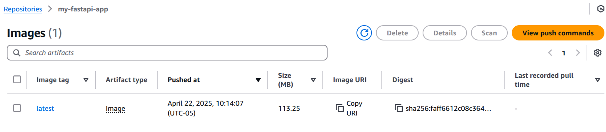
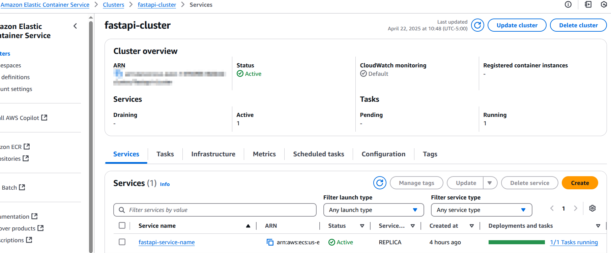
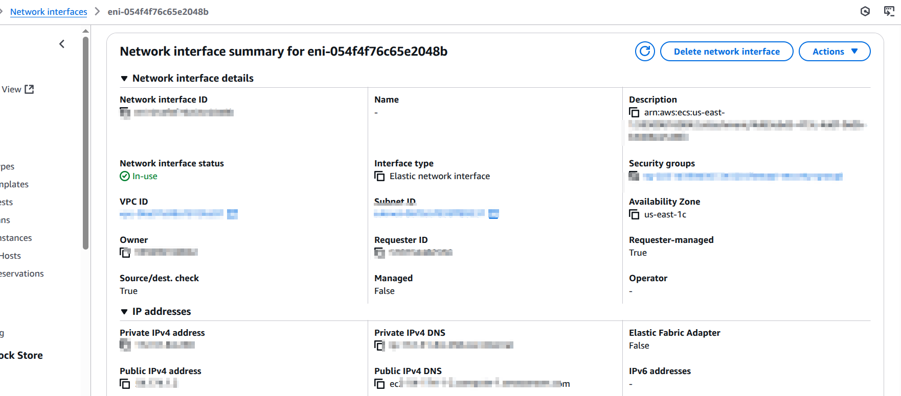
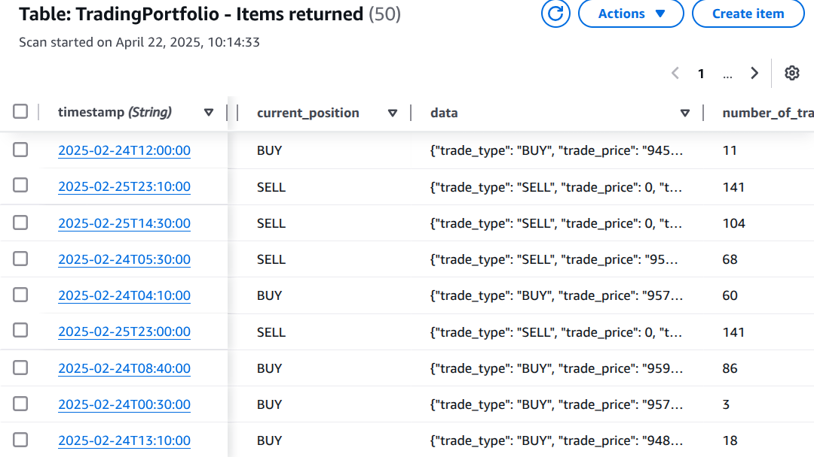

# 📈 Trading Signal Processing System

This repository contains a production-ready trading signal processing system that receives pre-generated trading signals and simulates trading decisions based on them. The system is built with FastAPI, containerized using Docker, and deployed on **Amazon ECS**.

---

## 🚀 Features

- REST API for submitting and retrieving signal-related data
- Handles pre-generated trading signals (BUY, SELL, HOLD)
- Tracks trading performance over time
- CSV file support for bulk signal uploads
- Deployed to AWS ECS using a container image hosted on Amazon ECR
- Portfolio performance stored in DynamoDB

---

## 🛠️ Tech Stack

- **FastAPI** for building the API
- **Uvicorn** as the ASGI server
- **Docker** for containerization 🐳
- **AWS ECS** for deployment
- **DynamoDB** for cloud storage
- **Pydantic** for validation
- **Python 3.12**

---

## 📦 Endpoints

### `GET /health`

Check if the service is running.

**Response:**
json
{
  "status": "healthy",
  "timestamp": "2025-04-22T14:27:02.773948"
}

### `POST /signal`

Submit a CSV file containing pre-generated signals.

Request:

    Content-Type: multipart/form-data

    Field name: file

    File: CSV with the following columns:

datetime,close,mvrv_btc_momentum,spot_volume_daily_sum,signal,sentiment,dominant_emotions

curl -X POST http://<your-ecs-public-ip>/signal -F "file=@gold.csv"

Response:

{
  "message": "File processed successfully.",
  "processed_rows": 100
}

### `GET /signal/{timestamp}`

Get signal info and related trading data for a specific timestamp.

Example:

curl http://<your-ecs-public-ip>/signal/2025-02-24T18:00:00

Response:

{
  "datetime": "2025-02-24T18:00:00",
  "signal": 1,
  "action": "BUY",
  "performance": { ... }
}

### `GET /performance`

Returns performance of the last operation and summary of trading outcomes.

Response:

{
  "total_returns": 0.127,
  "positions_executed": 32,
  "last_trade": {
    "datetime": "2025-04-22T12:00:00",
    "action": "SELL",
    "price": 92500.0
  }
}

🗃️ Data Storage
 
 - Portfolio performance and signal logs are stored in DynamoDB
 - Tables are created automatically on first run if they don’t exist
 - CloudWatch display loggings of executions

📸 Screenshots

📚 **Documentation**

The system’s API  is available at the following URL:

- [API](http://13.217.209.241/docs#)

You can also view a specific section of the documentation at:

- [Specific Section Documentation](http://13.217.209.241/redoc#)

